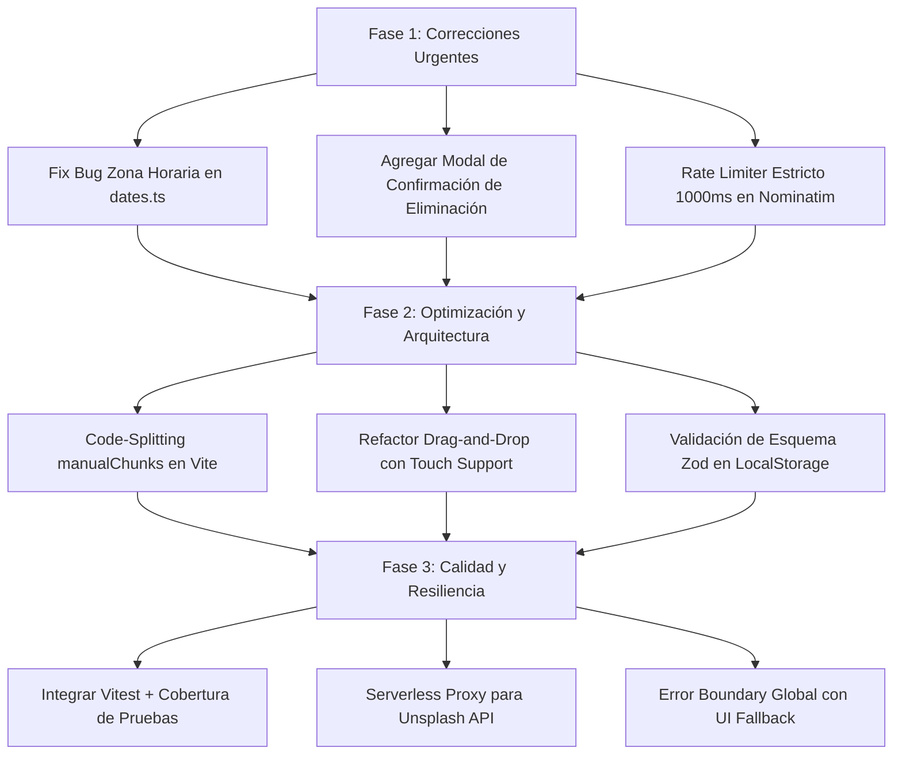

# 🔍 Roamly — Reporte de Auditoría y Code Review Completo

**Repositorio:** `~/Developer/Roamly`  
**Fecha:** 5 de Agosto de 2026  
**Alcance (Scope):** Todo el repositorio (`src/`, `package.json`, `tsconfig`, `eslint`, `vite`, `tailwind`, UI/UX, APIs, Contexts, Utils)  
**Evaluador:** Agentic AI Code Auditor (Metodología Senior Software Architect)

---

## 📊 Resumen Ejecutivo (Executive Summary)

Se ha completado una revisión exhaustiva (*Full Code Audit*) del repositorio **Roamly**, una aplicación web progresiva de planificación de viajes basada en React 19, TypeScript, Tailwind CSS, Leaflet y Vite.

La aplicación presenta un diseño visual muy cuidado con efectos de *glassmorphism*, dark mode y mapas interactivos. Sin embargo, la auditoría ha identificado **vulnerabilidades de seguridad, fallos críticos de arquitectura (incluyendo un bug severo de zona horaria), cuellos de botella de rendimiento y debilidades de calidad que afectan la resiliencia en producción**.

### Matriz de Hallazgos por Severidad

| Severidad | Seguridad | Rendimiento | Arquitectura | Calidad / DX | Total |
| :--- | :---: | :---: | :---: | :---: | :---: |
| 🔴 **CRÍTICO** | 0 | 0 | 1 | 0 | **1** |
| 🟠 **ALTO** | 2 | 2 | 2 | 1 | **7** |
| 🟡 **MEDIO** | 2 | 2 | 1 | 1 | **6** |
| 🔵 **BAJO / INFO** | 1 | 1 | 1 | 2 | **5** |
| **TOTAL** | **5** | **5** | **5** | **4** | **19** |

---

## 🚨 Hallazgos Críticos y de Alta Prioridad

### 1. 🔴 [CRÍTICO] Bug de Zona Horaria en `generateDayPlans` (`src/utils/dates.ts`)
- **Descripción:** La función crea objetos `Date` locales con `new Date(startDate + 'T00:00:00')` y posteriormente llama a `current.toISOString().slice(0, 10)`.
- **Impacto:** En cualquier zona horaria con desplazamiento UTC positivo (Europa, Asia, África, Oceanía), `new Date("2026-10-12T00:00:00")` corresponde a las `22:00:00` o `15:00:00` del día anterior en tiempo UTC. Al extraer los primeros 10 caracteres del string ISO, **las fechas de todos los días del itinerario se desplazan -1 día**, corrompiendo los planes de viaje de usuarios fuera de América.
- **Ubicación:** [`src/utils/dates.ts`](file:///Users/eduardotorres/Developer/Roamly/src/utils/dates.ts#L15-L29)

### 2. 🟠 [ALTO] Exposición de Claves API de Cliente en el Bundle Web (`VITE_UNSPLASH_ACCESS_KEY`)
- **Descripción:** `import.meta.env.VITE_UNSPLASH_ACCESS_KEY` se incluye directamente en la compilación de Vite de React.
- **Impacto:** Las claves de Unsplash quedan expuestas públicamente en el código minificado cliente (`dist/assets/index-*.js`), permitiendo su extracción y uso no autorizado por terceros.
- **Ubicación:** [`src/utils/destinationImages.ts`](file:///Users/eduardotorres/Developer/Roamly/src/utils/destinationImages.ts#L210)

### 3. 🟠 [ALTO] Violación de Políticas de Uso y Rate-Limiting de Nominatim
- **Descripción:** En `geocodeActivity` se utiliza un `setTimeout` de 200 ms. La política oficial de uso de Nominatim (OpenStreetMap) exige **un máximo estricto de 1 petición por segundo (1000 ms)**. Además, las llamadas concurrentes entre componentes no están coordinadas.
- **Impacto:** Riesgo de bloqueo permanente de IP o respuestas HTTP 429 (*Too Many Requests*) para los usuarios.
- **Ubicación:** [`src/utils/geocoding.ts`](file:///Users/eduardotorres/Developer/Roamly/src/utils/geocoding.ts#L62-L66)

### 4. 🟠 [ALTO] Eliminación Destructiva Sin Confirmación (Pérdida Accidental de Datos)
- **Descripción:** Al presionar el botón de eliminar viaje en `TripCard` o eliminar actividad en `ActivityItem`, los datos se borran inmediatamente de `localStorage` sin modal de confirmación ni opción de deshacer (*undo*).
- **Impacto:** Alta probabilidad de pérdida irrecuperable de itinerarios enteros por toques accidentales en pantallas táctiles.
- **Ubicaciones:**
  - [`src/components/dashboard/TripCard.tsx`](file:///Users/eduardotorres/Developer/Roamly/src/components/dashboard/TripCard.tsx#L93-L99)
  - [`src/components/trip/ActivityItem.tsx`](file:///Users/eduardotorres/Developer/Roamly/src/components/trip/ActivityItem.tsx#148-L154)

### 5. 🟠 [ALTO] Bundle Monolítico JS Excede 500 kB
- **Descripción:** `dist/assets/index-Bjr8Qa-5.js` pesa 514.94 kB. No hay *code-splitting* ni `manualChunks` configurados en `vite.config.ts`.
- **Impacto:** Tiempos de carga inicial (FCP/LCP) elevados en dispositivos móviles o conexiones 3G/4G.
- **Ubicación:** [`vite.config.ts`](file:///Users/eduardotorres/Developer/Roamly/vite.config.ts#L6-L20)

### 6. 🟠 [ALTO] Incompatibilidad de Drag-and-Drop en Navegadores Móviles Táctiles
- **Descripción:** La reordenación de actividades utiliza la API nativa de HTML5 (`draggable`, `onDragStart`, `onDrop`), la cual carece de soporte nativo en iOS Safari y Android Chrome.
- **Impacto:** Los usuarios móviles no pueden reordenar actividades en sus itinerarios.
- **Ubicación:** [`src/components/trip/ActivityItem.tsx`](file:///Users/eduardotorres/Developer/Roamly/src/components/trip/ActivityItem.tsx#L82-L92)

### 7. 🟠 [ALTO] Ausencia Total de Pruebas Automatizadas (0% Cobertura)
- **Descripción:** No existe infraestructura de pruebas (Vitest / Testing Library) en `package.json`.
- **Impacto:** Alta vulnerabilidad a regresiones en la lógica de cálculo de fechas, parsing ICS, geocodificación y manipulación de estado.
- **Ubicación:** [`package.json`](file:///Users/eduardotorres/Developer/Roamly/package.json#L6-L11)

---

## 🛠️ Plan de Acción Recomendado (Roadmap de Solución)

---

## 📁 Estructura del Reporte en `.audit/`

Para una revisión detallada módulo por módulo, consulta los siguientes archivos en la carpeta `.audit/`:

1. [🛡️ Auditoría de Seguridad](file:///Users/eduardotorres/Developer/Roamly/.audit/security.md) (`.audit/security.md`)
2. [⚡ Auditoría de Rendimiento](file:///Users/eduardotorres/Developer/Roamly/.audit/performance.md) (`.audit/performance.md`)
3. [🏗️ Auditoría de Arquitectura](file:///Users/eduardotorres/Developer/Roamly/.audit/architecture.md) (`.audit/architecture.md`)
4. [💎 Auditoría de Calidad y DX](file:///Users/eduardotorres/Developer/Roamly/.audit/quality.md) (`.audit/quality.md`)
